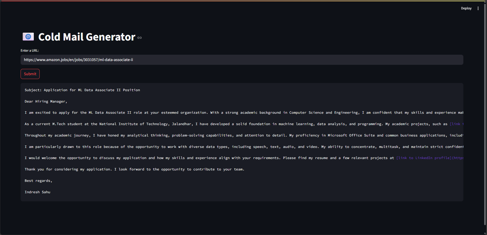

# 📧 Cold Mail Generator
Cold email generator for job outreach using Groq, Langchain, and Streamlit.
It allows users to input the URL of a company's careers page. The tool then extracts job listings from that page and generates personalized cold emails. These emails include relevant project or portfolio links sourced from a vector database, tailored to the specific job descriptions.
**Imagine a scenario:**

Amazon or Microsoft is hiring for a Principal Software Engineer and is investing significant time and resources into recruitment, onboarding, and training.
I, Indresh Sahu, an M.Tech CSE student at the National Institute of Technology Jalandhar, aim to reach out to these companies with a cold email demonstrating how my background and capabilities align with their needs — offering a potential solution that saves them time and brings immediate technical expertise.

This tool not only automates the cold email writing process but also ensures personalization by understanding the job context and aligning it with relevant academic or project experiences.
By leveraging advanced language models through Langchain and the ultra-fast processing power of Groq, the system ensures rapid and high-quality email generation.
Streamlit provides an intuitive and interactive front-end where users can simply paste a job URL and instantly get a customized email draft.
The portfolio links are selected intelligently from a vector database, allowing the system to match the job requirements with the most appropriate past work or academic projects.
This makes outreach efforts more meaningful and increases the chance of engagement from recruiters or hiring managers.

Ultimately, this tool bridges the gap between student candidates and leading tech companies by making first contact smarter, faster, and more relevant.



## Set-up
1. To get started we first need to get an API_KEY from here: https://console.groq.com/keys. Inside `app/.env` update the value of `GROQ_API_KEY` with the API_KEY you created. 


2. To get started, first install the dependencies using:
    ```commandline
     pip install -r requirements.txt
    ```
   
3. Run the streamlit app:
   ```commandline
   streamlit run app/main.py
   ```
   
